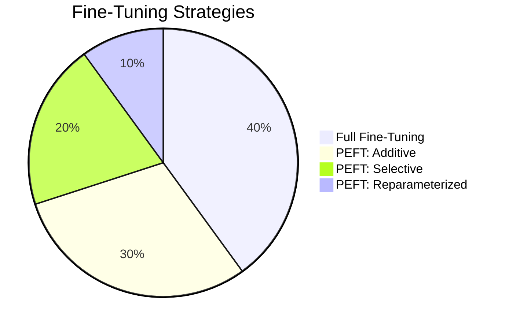

# Fine-Tuning Algorithms for Large Models: A Comprehensive Study

**Abstract:** Fine-tuning transforms a large pretrained model into a specialized one by additional training on task-specific data. Traditional *full fine-tuning* updates all model weights, offering flexibility at high cost, while *parameter-efficient fine-tuning* (PEFT) methods modify only a small subset or add lightweight modules. This report surveys and compares these approaches. We categorize fine-tuning into full tuning, parameter-efficient tuning (additive, selective, reparameterized, hybrid), and note alternatives. We explain key PEFT methods—**LoRA**, **QLoRA**, **Adapters**, **Prompt Tuning**, **Prefix Tuning**, and **BitFit**—covering their mechanisms, uses, trade-offs, and efficiency. We then examine how these techniques are applied to large language models (LLMs) for instruction-following, dialogue, summarization, and RLHF-based alignment, as well as to vision-language models (VLMs) for visual question-answering and captioning. We compare fine-tuning across LLM, masked-LM, and VLM architectures, noting similarities and special considerations. Finally, we discuss infrastructure implications: GPU/TPU requirements, memory, training time, and the tools/frameworks commonly used (e.g., Hugging Face Transformers/PEFT, DeepSpeed).

## 1. Introduction

Large **pre-trained models** have revolutionized AI by learning general representations from massive data. For example, transformer-based language models are first trained on vast text corpora and then *fine-tuned* on specific tasks. Fine-tuning adapts a model to new data or objectives by further gradient-based training. This is a core technique in transfer learning: the model has learned broad knowledge from pretraining and is refined on task-specific data. Full fine-tuning means updating *all* weights, which can achieve top accuracy but requires enormous compute resources. An alternative is **parameter-efficient fine-tuning (PEFT)**, which freezes most of the pretrained model and trains only a small, task-specific set of parameters. PEFT dramatically reduces the computational and memory requirements for fine-tuning. The primary categories of fine-tuning are **full fine-tuning**, **additive PEFT** (introducing new modules like adapters or prompts), **selective PEFT** (training only a subset of the model parameters), and **reparameterized PEFT** (factorized updates like LoRA).

## 2. Categories of Fine-Tuning

Fine-tuning algorithms can be broadly classified into the following categories:

- **Full Fine-Tuning:** In this approach, all parameters of the pretrained model are updated during fine-tuning. This offers maximum flexibility and is most effective for tasks where the model needs to fully adapt to the new data. However, full fine-tuning is computationally expensive and requires significant GPU memory. Moreover, it risks overfitting or forgetting previously learned knowledge. For instance, fine-tuning a 175B-parameter model like GPT-3 requires vast memory (hundreds of GB) and takes several weeks on high-end GPUs【12†L115-L122】.

- **Parameter-Efficient Fine-Tuning (PEFT):** This approach updates only a small fraction of the model parameters or adds new lightweight modules, while the rest of the pretrained model remains frozen. PEFT drastically reduces the number of trainable parameters, memory requirements, and training time. There are several types of PEFT methods, including **additive**, **selective**, and **reparameterized** approaches, as well as **hybrid** methods that combine elements of different techniques.

- **Other Approaches:** Besides traditional fine-tuning, there are alternative techniques such as **feature extraction** (where the model is used as a fixed feature extractor and only the output head is trained) and **distillation** (where a smaller model is trained to mimic the behavior of a larger model). While these methods are not strictly "fine-tuning," they are commonly used for model adaptation.

### Taxonomy of Fine-Tuning Strategies
The figure below provides a visual representation of various fine-tuning strategies:

## 3. Prominent PEFT Methods

### 3.1 LoRA and QLoRA (Low-Rank Adaptation)

**LoRA (Low-Rank Adaptation)** is a technique that decomposes weight updates into low-rank matrices. For a weight matrix \(W \in \mathbb{R}^{d 	imes d}\), LoRA approximates the update as \(BA\), where \(A \in \mathbb{R}^{d 	imes r}\) and \(B \in \mathbb{R}^{r 	imes d}\) with \(r \ll d\). The backbone weights \(W\) remain frozen during fine-tuning, and only the low-rank matrices \(A\) and \(B\) are trained. This significantly reduces the number of parameters that need to be updated, which in turn reduces both computational cost and memory requirements【12†L106-L112】.

A recent extension of LoRA is **QLoRA (Quantized LoRA)**, which further optimizes memory usage by quantizing the model's weights to 4-bit precision. QLoRA enables fine-tuning of massive models (e.g., 65B-parameter models) on a single 48GB GPU in just 24 hours, without compromising the model’s accuracy【51†L37-L40】. QLoRA provides a significant memory saving over full precision (32-bit) training, making it accessible for teams with limited resources【12†L115-L124】.

**Advantages of LoRA:**
- Drastically reduces memory and compute costs.
- Typically matches full fine-tuning performance on language tasks【12†L115-L124】.
- Suitable for very large models.

**Disadvantages of LoRA:**
- May be less effective when task requirements demand significant model updates across many layers.
- Hyperparameter tuning (e.g., choosing rank \(r\)) is crucial for optimal performance.

### 3.2 Adapter Layers

**Adapter-based fine-tuning** involves inserting small neural networks (MLPs) into each transformer block. These adapters are trained while keeping the rest of the model frozen. Adapters introduce very few parameters compared to full fine-tuning, typically around 2–5% of the total model parameters. This allows for efficient task adaptation while keeping the base model intact. Adapters are modular, meaning they can be stacked or shared across different tasks【57†L562-L571】.

**Advantages of Adapters:**
- Modular and can be reused for different tasks.
- Only a small number of parameters are introduced, minimizing resource usage.
- Suitable for large-scale models with limited compute.

**Disadvantages of Adapters:**
- Adds a small overhead during inference due to extra computations from the adapter layers.
- May not perform as well as full fine-tuning for certain tasks, particularly when large amounts of domain-specific data are available.

### 3.3 Prompt Tuning

**Prompt tuning** involves learning task-specific prompts that are prepended to the input sequence. These prompts are trainable and allow the model to adapt to specific tasks without modifying its underlying weights. This technique is particularly useful for very large models, where full fine-tuning would be too resource-intensive. Prompt tuning can be combined with other PEFT methods such as LoRA to achieve better performance.

**Advantages of Prompt Tuning:**
- Extremely low memory and compute cost.
- Allows the model to perform well on a wide range of tasks with minimal updates.

**Disadvantages of Prompt Tuning:**
- Less effective for tasks requiring deep interaction with model weights.
- Performance may be suboptimal for tasks requiring fine-grained understanding.

### 3.4 Prefix Tuning

**Prefix tuning** is similar to prompt tuning but extends across the model layers. It introduces learnable vectors (prefix tokens) that influence the model’s attention mechanism. This allows the model to incorporate task-specific knowledge without full parameter updates. Prefix tuning is particularly effective for tasks like text generation, where a few learned tokens can guide the entire output.

**Advantages of Prefix Tuning:**
- More effective for sequence generation tasks compared to prompt tuning.
- Minimal computational overhead after training.

**Disadvantages of Prefix Tuning:**
- Requires careful tuning of the prefix length and layer integration.
- Less applicable for non-generative tasks.

### 3.5 BitFit

**BitFit** is a minimalist approach to fine-tuning, where only the bias terms of the model are updated during training. All other model weights remain frozen. This approach is very lightweight in terms of computational requirements and memory usage but typically only works well for smaller models or when the task is closely aligned with the pretrained model.

**Advantages of BitFit:**
- Extremely low resource requirements.
- Fast training with minimal overhead.

**Disadvantages of BitFit:**
- Generally underperforms compared to more sophisticated methods like LoRA or adapters for complex tasks.
- Limited to small-scale fine-tuning or tasks with simple requirements.

## 4. Fine-Tuning LLMs: Tasks and Techniques

### 4.1 Common LLM Fine-Tuning Tasks

Large Language Models (LLMs) have a wide range of applications in NLP, including:

- **Instruction Tuning:** Fine-tuning a model to follow specific instructions (e.g., summarizing, answering questions).
- **Dialogue Generation:** Training the model to participate in natural conversations (e.g., chatbots).
- **Summarization:** Training the model to generate summaries of long documents or text.
- **Reinforcement Learning from Human Feedback (RLHF):** Fine-tuning a model using human-generated feedback to improve its outputs.

For instance, OpenAI's **InstructGPT** fine-tuned GPT-3 using human feedback to improve its ability to follow instructions【28†L153-L161】. Similarly, many chat models use RLHF to improve user alignment and safety【26†L98-L102】. 

PEFT methods such as LoRA are commonly used in instruction tuning and dialogue generation to save memory and accelerate training. For example, **Vicuna**, a fine-tuned version of LLaMA-13B, used LoRA to achieve competitive performance on instruction-following tasks【12†L115-L124】.

### 4.2 PEFT for RLHF

Reinforcement Learning from Human Feedback (RLHF) is an increasingly popular technique to refine LLM outputs. RLHF involves collecting human feedback (e.g., ranking responses to prompts) and using this to train a reward model. The reward model is then used to guide the fine-tuning of the LLM using reinforcement learning (usually via Proximal Policy Optimization)【26†L98-L102】. 

LoRA and other PEFT methods are being explored for use in RLHF to reduce computational overhead. These methods can significantly speed up the fine-tuning process without compromising performance.

## 5. Fine-Tuning Vision-Language Models (VLMs)

Vision-Language Models (VLMs) combine image and text processing to understand multimodal data. Common tasks include **visual question answering (VQA)**, **image captioning**, and **image-text retrieval**. Techniques like **LoRA**, **prompt tuning**, and **adapters** can be applied to these models to fine-tune them for specific tasks.

For example, **CLIP** is a widely used VLM for image-text matching, and **BLIP** is a vision-language model that excels in image captioning. PEFT methods such as **adapter-based tuning** have been successfully applied to these models, allowing them to efficiently adapt to new datasets and tasks【44†L70-L79】.

## 6. Comparative Analysis of Fine-Tuning Methods

The following table summarizes the key differences between full fine-tuning and PEFT methods across LLMs, VLMs, and MLMs:

| **Method**       | **Trainable Params**      | **GPU Memory Needed**    | **Inference Overhead**     | **Use Case**                        |
|------------------|--------------------------|--------------------------|----------------------------|-------------------------------------|
| Full Fine-Tune   | 100% of model            | Very High (gradients for all) | None (base speed)          | Highest accuracy; small models only |
| LoRA             | ~0.1–5% of model         | Moderate (only adapters) | None after merging weights【12†L122-L125】 | General adaptation for any model    |
| QLoRA            | ~0.1% (LoRA + 4-bit)     | Very Low (quantized 4-bit) | None after merging         | Huge models on limited GPUs         |
| Adapter          | ~1–5%                    | Moderate (adapter states) | Small extra MLP compute     | Domain/task adaptation             |
| Prompt Tuning    | ~0.01–0.1% (prompt tokens) | Very Low (only prompt vectors) | Slight (prepend tokens)   | Classification or generation with huge LMs |
| Prefix Tuning    | ~0.1% (prefix vectors)    | Low                      | Moderate (extra attention)  | Generation tasks (NLG)             |
| BitFit           | ~0.01% (biases only)      | Very Low                 | None                       | Quick prototyping, simple tasks    |

## 7. Infrastructure Implications

Fine-tuning large models has significant infrastructure considerations:

- **Compute and Memory:** Full fine-tuning of very large models (tens of billions of parameters) normally requires multiple high-memory GPUs or TPUs. For example, training GPT-3 (175B) reportedly involved thousands of V100 GPUs over weeks (costing millions)【24†L1-L4】. In contrast, PEFT drastically reduces memory. LoRA and adapters only store gradients for the new modules, cutting memory by ~×2–4. QLoRA’s 4-bit quantization slashes model storage to ~1/4, allowing a 65B model to fit on a single 48GB GPU【5†L66-L74】.

- **Training Time:** PEFT methods often converge faster in wall-clock time because there are fewer parameters to update and less data-parallel communication. For example, training using LoRA typically runs a similar number of epochs as full tuning but with smaller backward passes. QLoRA training can be slower per step due to quantized operations, but still far outpaces distributed full-tuning.

- **Scalability:** Infrastructure frameworks now support scaling PEFT. Hugging Face’s Accelerate library integrates with DeepSpeed and FSDP (Fully Sharded Data Parallel) to enable both PEFT and full fine-tuning at scale【54†L99-L108】.

## 8. Conclusion

Fine-tuning large models is a key technique in AI, enabling general-purpose foundations to excel on specific tasks. We have surveyed the spectrum of fine-tuning algorithms: from **full** updates of all weights to **parameter-efficient** methods like **LoRA**, **Adapters**, **Prompt/Prefix Tuning**, and **BitFit**. Each approach offers a different trade-off between **parameter count**, **compute cost**, and **performance**. LoRA-based methods (including quantized variants) have emerged as a practical standard for adapting huge LLMs with modest resources. Adapters and prompts remain popular for both NLP and vision tasks, while BitFit serves niche cases.

In application, both LLMs and vision-language models use these techniques. Instruction tuning and RLHF fine-tune LLMs into dialogue agents, often via LoRA to stay efficient. VLMs leverage similar ideas to learn from images and text. We find that, although architectures differ, the underlying themes are consistent: large frozen backbones plus small trainable components.

From an infrastructure viewpoint, PEFT methods substantially reduce the GPU, memory, and time requirements of fine-tuning, making it accessible beyond a few well-funded labs. Tools like Hugging Face Transformers and PEFT library, together with DeepSpeed and quantized optimizers, have democratized large-model fine-tuning. However, even PEFT requires careful engineering: quantization may need calibration, ZeRO setups must be configured, and larger models still require high-end GPUs.

**References:** The statements above are supported by recent research and technical sources, including Hugging Face’s documentation【12†L106-L112】【50†L135-L143】, OpenAI publications【28†L153-L161】, and contemporary surveys【57†L536-L544】【43†L228-L237】.
